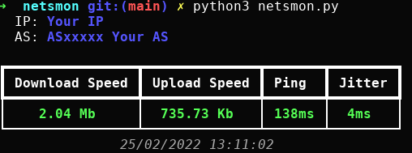
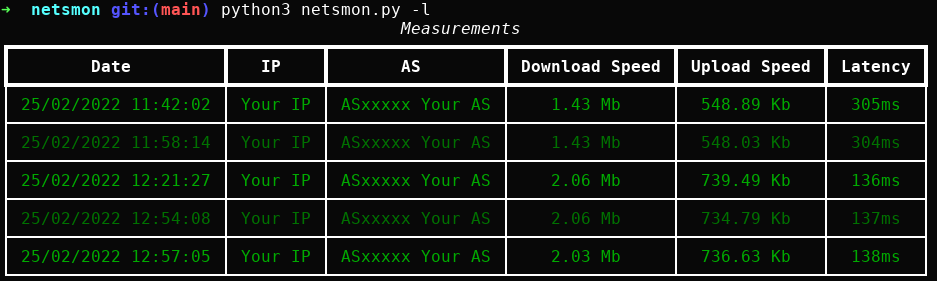
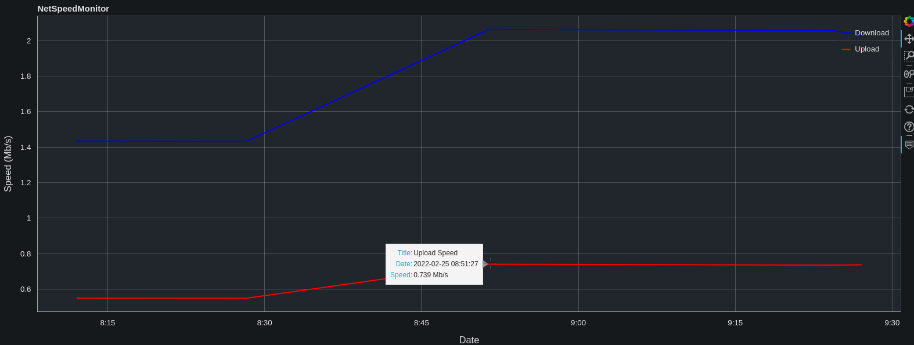
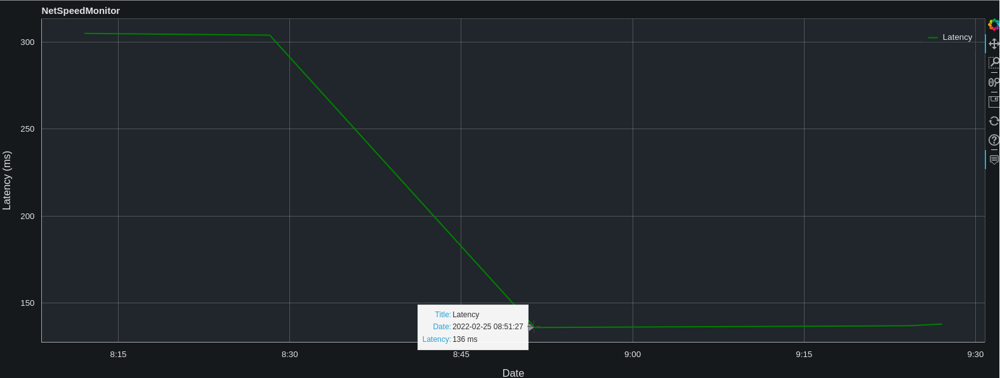

# netsmon
Measure your internet speed.

Visualize your internet speed over time.

## How to use

#### Measure your internet speed
```
python3 netsmon.py
```
#### Visualize your internet speed measurements
```
python3 netsmon.py --visualize
```

## Examples
### Measure internet speed

### List all measurements

### Visualize internet speed

### Visualize network latency
